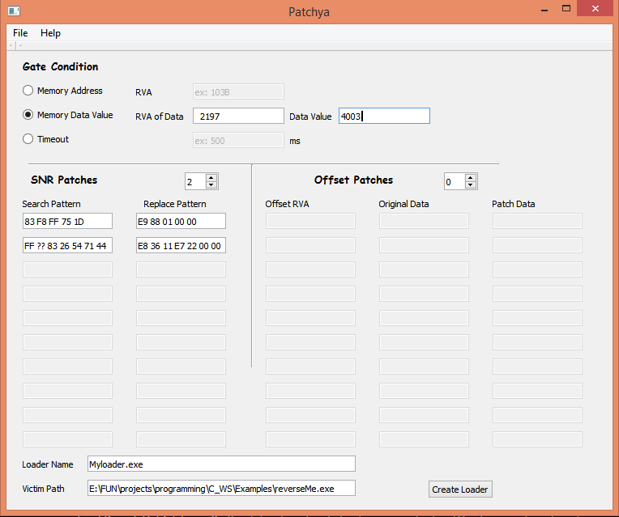

# patchya

patchya is a Run-time loader and patcher for executables. It can be configured through patchya-configurator with a few simple steps

#

### Features
* Portable: patchya is built to be portable, all the logic that is Arch/OS dependent, data types, standard library calls..... are implemented under Arch directory.
* Flexible: patchya code is very modular, you can simply add, remove or replace modules as searching and debugging APIs.
* GUI configurator: patchya has a user-friendly GUI configurator built with QT.
* Gate conditioning with 3 different types
* Offset patching and Search and Replace patching with '?' wildcard.
* Logging: the loader has a logging feature that is enabled by default, it can be used to detect problems with integration between configurator and loader and run-time errors inside the loader.

#

### How to use

Using patchya is very straightforward. First, you choose the Gate condition form one of the three options
1. Memory Address (RVA) : when this address is reached the loader will start patching
2. Memory Value: when the data in a certain memory address becomes a certain value it will start patching.
3. Timeout: start patching after a certain time in milliseconds.

Then you choose the number of offset and SNR patches.

Finally, you fill the data for the patches.

For SNR patches you need to fill:
1. Search Pattern, which is the Hex to search for, it supports '?' wildcard.
2. The Replace Pattern, The hex to replace the search pattern, it should match in size of Search Pattern.

For Offset Patches, you need to fill
1. Address of patched data (RVA).
2. Original Data.
3. Replace Data.
The Original and Replace Data sizes should match.

The Data in the offset address will be read in run-time and compared with the Original Data if they are different it will not patch the address.

There are 2 examples under Examples directory. one with unpacked exe and the other with packed exe. 

#

### Build from source
***Configurator dependencies***:

patchya-configurator uses QT, it was developed with QT 5.11.1 and MinGW 32 bit

***Steps, to Build***
1) ***First build QT project***
    * Use QT creator, open and build the or through CMD
2) ***Second, Build the Loader***

    * Create folder with name Build inside patchy-loader 
	
    * from project parent directory type
    
    '$(MAKE)'
3) ***Finally, Set executables to correct paths(optional)***

    * '$(MAKE) install'
    
#

### FAQ
***What is patchya used for ?*** 

Patchya is a generic run-time patcher it can be used in many applications as
* Testing executables security.
* Fault injection in run-time.
* Solving reversing challenges!

***My loader is not working ?*** 

This is an initial version, it should have bugs, there is a generated log file during the execution that can be used to detect issues in configuration and run-time errors in loader. If you found any issue please open an issue on Github.

***Can I contribute?***

Yes of course, just try to follow the naming rules and portability of code.

#

### Future Work

* Port to GNU/Linux.
* Support 64-bit windows executables.
* DLL patching.
* Apply Anti-Anti Debugging techniques.
* Use exceptions as Gate Condition for patching.
* Use regex for Search and Replace Patching
* Add option to search and replace with assembly instructions directly.
* Refactor QT configurator code (this is my first QT project, so it's a mess :D)
* Make Doxygen documentation

#

### Disclaimer

patchya wasn't built to be used in illegal applications. The author has no liability and is not responsible for any misuse or damage caused by patchya.

#

### License

This project is under The 3-Clause BSD License.
